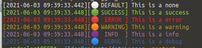

# Color Logger



## Usage
A simple usage example:
```dart
import 'package:color_logger/color_logger.dart';

void main() {
  var console = ColorLogger();
  console.log('This is a none');
  console.log('This is a success', status: LogStatus.success);
  console.log('This is a error',  status: LogStatus.error);
  console.log('This is a warning',  status: LogStatus.warning);
  console.log('This is a info',  status: LogStatus.info);
  console.log('This is a debug',  status: LogStatus.debug);
}
```
